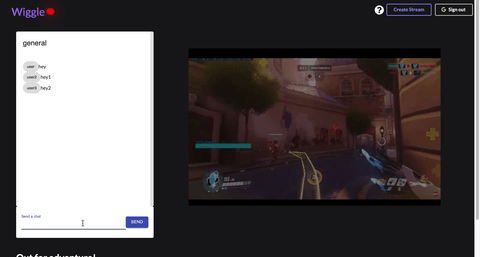

# Wiggle

A CRUD App inspired by the popular streaming website Twitch.tv.



## Getting Started

Clone this repository for a copy on your machine. Deployment will be available soon!

### Prerequisites

This app requires the program OBS. You can download OBS for free: [here](https://obsproject.com/download/) 


### Installing and Start up

A step by step to run locally:

To get started and run all necessary servers, run the following in different terminals:
```
cd rtmpserver
yarn start

```
```
cd src
yarn start

```
```
cd api
yarn start

```
```
cd server
yarn start

```


Open OBS and click on the settings button.
On the left handside, click stream.
Under the service dropdown, select custom.
In the URL field, input trmp://localhost/live.
Under the Stream key, input the stream id found in the browser.

```
http://localhost:3000/streams/2
id I would input is 2.

```

then on OBS, hit start streaming, and you should see your stream live!


## Deployment

Will be available soon!

## Built With

* [React](https://reactjs.org/) - The web framework used
* [Redux](https://redux.js.org/) - Used for state management
* [https://socket.io/](https://maven.apache.org/) - realtime engine for a chat system
* [flv.js](https://github.com/bilibili/flv.js/blob/master/docs/livestream.md) - Video support for live streaming


